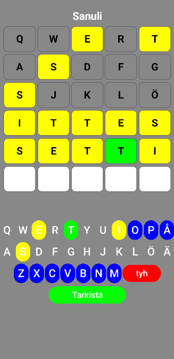

## Sanuli
- Game where user has to guess word and has six tries. word length is always 5 character.
- Green on the keyboard or in the character box means the character is in the right place and it is in the word
- Yellow on the keyboard or in the character box means the character is not in the right place but it is in the word
- Gray on the keyboard or in the character box means the character is not in the right place and it is not in the word

